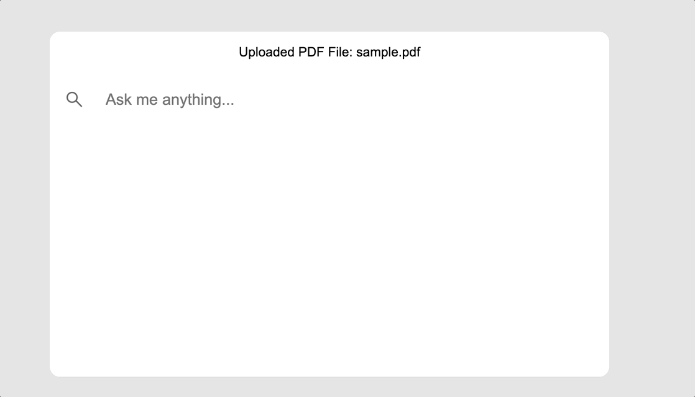

# 10-pager

Why spend time reading, summarizing, and interpreting a document when you have an AI to do it for you?

10-pager is chatbot AI that helps you to breakdown and understand a document by answering your specific questions on the document. 

Example usage: Prompting 10-pager various questions regarding an offer letter: 

#### Currently supported documents:
- pdf

#### Currently Supported OpenAI type:
- Azure OpenAI

### Using 10-pager
1. Clone this repo 
2. Frontend setup:
   - Navigate to `10-pager-frontend` and follow this [instruction](./10-pager-frontend/README.md) 
1. Backend setup:
   - Navigate to `backend` and follow this [instruction](./backend/README.md)
   - The backend will be available at `localhost:5002`
4. Navigate to `localhost:5173` in your browser
5. You can now use 10-pager! 

